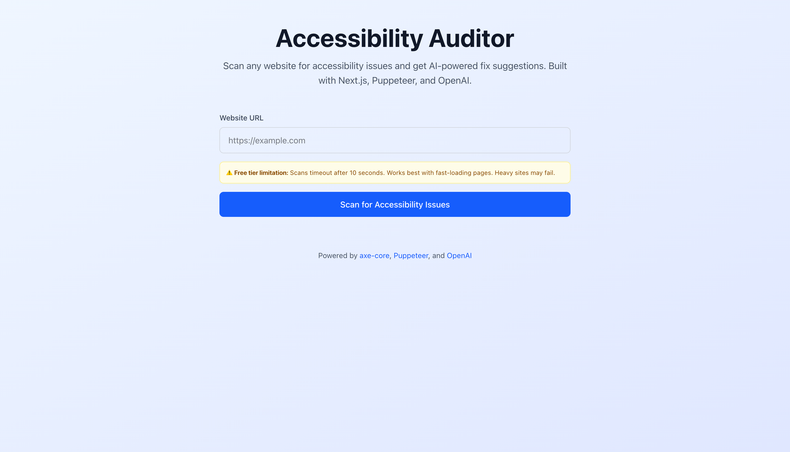
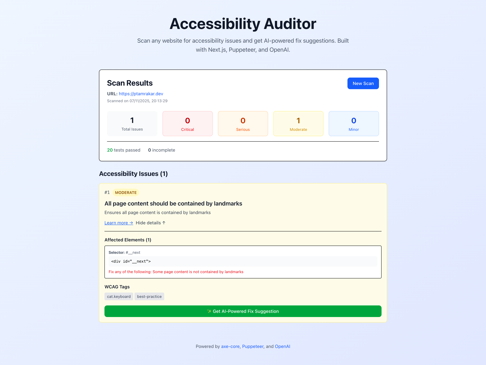
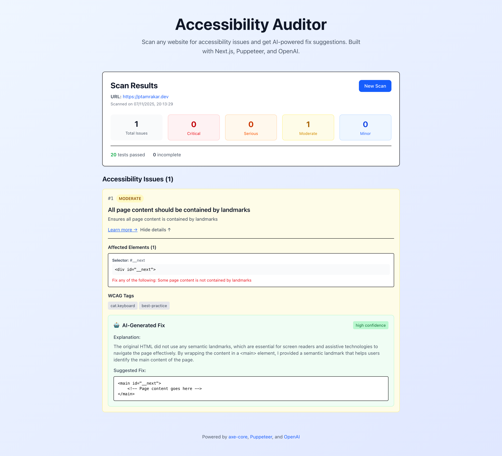

# 🎯 Accessibility Auditor


An AI-powered web accessibility auditor that scans websites for WCAG compliance issues and provides intelligent fix suggestions using OpenAI GPT-4.

## ✨ Features

- 🔍 **Real Browser Testing** - Uses Puppeteer to test actual rendered pages with JavaScript
- 🤖 **AI-Powered Fixes** - OpenAI GPT-4 generates contextual accessibility fixes
- 📊 **Comprehensive Reporting** - Categorizes issues by severity (Critical, Serious, Moderate, Minor)
- 🎨 **Beautiful UI** - Modern, responsive interface built with Tailwind CSS
- ⚡ **Fast & Efficient** - Optimized for Vercel's free tier with serverless functions
- 🌐 **WCAG Compliant** - Tests against Web Content Accessibility Guidelines (WCAG)

## 🚀 Live Demo

🔗 **[View Live Demo](https://your-project.vercel.app)** _(Update with your actual URL)_

## 📸 Screenshots

### Home Screen



### Scan Results



### AI Fix Suggestions



## 🛠️ Tech Stack

| Technology             | Purpose                         |
| ---------------------- | ------------------------------- |
| **Next.js 16**         | React framework with App Router |
| **TypeScript**         | Type-safe development           |
| **Tailwind CSS**       | Utility-first styling           |
| **Puppeteer**          | Headless browser automation     |
| **axe-core**           | Accessibility testing engine    |
| **OpenAI GPT-4o-mini** | AI-powered fix suggestions      |
| **Vercel**             | Serverless deployment platform  |

## 📋 Prerequisites

Before you begin, ensure you have:

- **Node.js** 18.17 or higher
- **npm** or **yarn** or **pnpm**
- **OpenAI API Key** ([Get one here](https://platform.openai.com/api-keys))
- **Google Chrome** or **Chromium** (for local development)

## 🔧 Installation

### 1. Clone the Repository

```bash
git clone https://github.com/pariweshh/accessibility-auditor.git
cd accessibility-auditor
```

### 2. Install Dependencies

```bash
npm install
```

### 3. Set Up Environment Variables

Create a `.env.local` file in the root directory:

```env
OPENAI_API_KEY=sk-your-openai-api-key-here
NODE_ENV=development
```

**For Chrome Path (Optional):**

```env
CHROME_EXECUTABLE_PATH=/path/to/your/chrome
```

### 4. Run Development Server

```bash
npm run dev
```

Open [http://localhost:3000](http://localhost:3000) in your browser.

## 🌐 Deployment

### Vercel Free Tier Limitations

⚠️ **Important:** The free tier has these limits:

- **10-second timeout** per function execution
- **1024MB memory** per function
- Works best with fast-loading websites

For production use with complex sites, consider upgrading to Vercel Pro.

## 📖 Usage

### Basic Scan

1. Enter a website URL (e.g., `https://example.com`)
2. Click "Scan for Accessibility Issues"
3. Wait 5-10 seconds for results

### Get AI Fix Suggestions

1. Click "Show details" on any issue
2. Click "✨ Get AI-Powered Fix Suggestion"
3. View the AI-generated fix with explanation

### Understanding Results

Issues are categorized by severity:

| Severity        | Description                      | Action Required      |
| --------------- | -------------------------------- | -------------------- |
| 🔴 **Critical** | Major barriers, fix immediately  | High priority        |
| 🟠 **Serious**  | Significant issues, fix soon     | Medium-high priority |
| 🟡 **Moderate** | Noticeable problems, should fix  | Medium priority      |
| 🔵 **Minor**    | Small improvements, nice to have | Low priority         |

## 📂 Project Structure

```
accessibility-auditor/
├── app/
│   ├── api/
│   │   ├── scan/
│   │   │   └── route.ts           # Scan endpoint
│   │   └── fix-suggestions/
│   │       └── route.ts           # AI fix endpoint
│   ├── page.tsx                   # Home page
│   ├── layout.tsx                 # Root layout
│   └── globals.css                # Global styles
├── components/
│   ├── ScanForm.tsx               # URL input form
│   ├── ResultsDisplay.tsx         # Results summary
│   └── IssueCard.tsx              # Individual issue display
├── lib/
│   ├── scanner.ts                 # Puppeteer scanning logic
│   ├── ai-fixer.ts                # OpenAI integration
│   └── types.ts                   # TypeScript types
├── public/                        # Static assets
├── docs/                          # Documentation
├── .env.local                     # Environment variables (gitignored)
├── .gitignore
├── next.config.js
├── tailwind.config.js
├── tsconfig.json
├── vercel.json                    # Vercel configuration
├── package.json
└── README.md
```

## 🔌 API Routes

### POST `/api/scan`

Scans a URL for accessibility issues.

**Request:**

```json
{
  "url": "https://example.com",
  "includeScreenshot": false
}
```

**Response:**

```json
{
  "url": "https://example.com",
  "timestamp": "2025-01-15T10:30:00.000Z",
  "violations": [...],
  "passes": 45,
  "incomplete": 2,
  "summary": {
    "critical": 2,
    "serious": 5,
    "moderate": 8,
    "minor": 3
  }
}
```

### POST `/api/fix-suggestions`

Generates AI-powered fix suggestions for issues.

**Request:**

```json
{
  "issues": [...],
  "limit": 5
}
```

**Response:**

```json
{
  "fixes": [
    {
      "issueId": "image-alt",
      "originalCode": "",
      "suggestedFix": "",
      "explanation": "Added descriptive alt text...",
      "confidence": "high"
    }
  ],
  "count": 5
}
```

## ⚙️ Configuration

### Customize Timeout (vercel.json)

```json
{
  "functions": {
    "app/api/scan/route.ts": {
      "memory": 1024,
      "maxDuration": 10
    }
  }
}
```

### Customize AI Model (lib/ai-fixer.ts)

```typescript
const completion = await openai.chat.completions.create({
  model: "gpt-4o-mini", // Change to 'gpt-4' for better quality
  temperature: 0.3,
  max_tokens: 500,
})
```

## 🧪 Testing

### Test URLs

**Fast-loading sites (recommended for free tier):**

- ✅ `https://example.com` - Simple static page
- ✅ `https://www.w3.org/` - W3C official site
- ✅ `https://developer.mozilla.org/` - MDN Web Docs
- ✅ `https://html5test.com/` - HTML5 testing site

**Intentionally inaccessible demo:**

- ⚠️ `https://www.w3.org/WAI/demos/bad/`

**Medium complexity sites:**

- 🔄 `https://github.com/` - Modern web application
- 🔄 `https://stackoverflow.com/` - Community site
- 🔄 `https://reddit.com/` - Social platform

**Complex sites (may timeout on free tier):**

- ⚠️ Heavy React/Next.js applications
- ⚠️ Sites with lots of JavaScript

### Run Locally

```bash
# Development
npm run dev

# Build
npm run build

# Production
npm run start

# Lint
npm run lint
```

## 💰 Cost Estimates

### Free Tier Usage

**Vercel (Free Tier):**

- 100GB bandwidth/month
- 100 hours serverless execution/month
- ~500-1000 scans per month (depending on page complexity)

**OpenAI API Costs (GPT-4o-mini):**

- Scan only: $0 (just uses axe-core)
- AI fix suggestion: ~$0.001-0.003 per fix
- 100 fixes ≈ $0.10-0.30

**Total Monthly Cost (Typical Usage):**

- Vercel: $0 (within free tier)
- OpenAI: $5-10 (moderate usage)
- **Total: ~$5-10/month**

## 🤝 Contributing

Contributions are welcome! Please follow these steps:

1. Fork the repository
2. Create a feature branch (`git checkout -b feature/amazing-feature`)
3. Commit your changes (`git commit -m 'Add amazing feature'`)
4. Push to the branch (`git push origin feature/amazing-feature`)
5. Open a Pull Request

### Development Guidelines

- Use TypeScript for type safety
- Follow the existing code style
- Add comments for complex logic
- Test with multiple websites before submitting

## 🐛 Known Issues & Limitations

1. **10-second timeout** on Vercel free tier - Some complex sites may fail
2. **JavaScript-heavy sites** may not fully render before scanning
3. **Authentication-protected pages** cannot be scanned
4. **Local network URLs** blocked for security in production
5. **Lighthouse scores** not included (only axe-core tests)

## 🔮 Future Enhancements

- [ ] PDF report export
- [ ] Scan history with database storage
- [ ] Batch scanning for multiple URLs
- [ ] Browser extension version
- [ ] Lighthouse integration
- [ ] Color contrast analyzer
- [ ] Keyboard navigation testing
- [ ] Screen reader simulation
- [ ] Multi-language support
- [ ] API for programmatic access

## 📚 Resources

- [WCAG Guidelines](https://www.w3.org/WAI/WCAG21/quickref/)
- [axe-core Documentation](https://github.com/dequelabs/axe-core)
- [Next.js Documentation](https://nextjs.org/docs)
- [Puppeteer Documentation](https://pptr.dev/)
- [OpenAI API Reference](https://platform.openai.com/docs)

## 📄 License

This project is licensed under the MIT License - see the [LICENSE](LICENSE) file for details.

## 👨‍💻 Author

**Your Name**

- GitHub: [@pariweshh](https://github.com/pariweshh)
- LinkedIn: [LinkedIn](https://www.linkedin.com/in/pariweshhtamrakar/)
- Portfolio: [Portfolio](https://ptamrakar.dev)

## 🙏 Acknowledgments

- [Deque Systems](https://www.deque.com/) for axe-core
- [Puppeteer Team](https://pptr.dev/) for browser automation
- [OpenAI](https://openai.com/) for GPT-4 API
- [Vercel](https://vercel.com/) for hosting
- [Web Accessibility Initiative (WAI)](https://www.w3.org/WAI/) for WCAG guidelines

## ⭐ Star History

If you find this project helpful, please consider giving it a star!

[](https://star-history.com/#YOUR_USERNAME/accessibility-auditor&Date)

---

<p align="center">Made with ❤️ and ☕ for a more accessible web</p>
